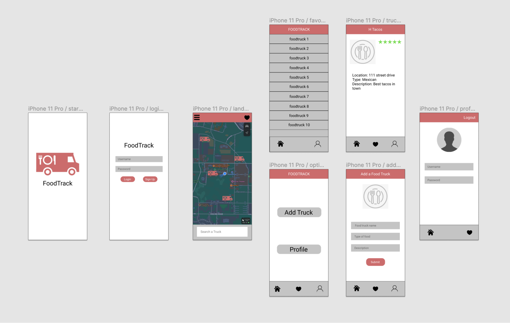

# Food Track

## Table of Contents
1. [Overview](#Overview)
1. [Product Spec](#Product-Spec)
1. [Wireframes](#Wireframes)
2. [Schema](#Schema)

## Overview
### Description
Our application will be a platform for food trucks to be able to create a profile and
share on a post their current location. Customers will be able to see where their
followed/favorite food trucks are currently at.

### App Evaluation
- **Category:** Food, Reviews
- **Mobile:** Apple Native
- **Story:** Allows food trucks to post their location and users to view those locations.
- **Market:** Anyone who owns a food truck and those who really enjoy eating from food trucks but don't always know their location
- **Habit:** Users will be able to get directions to a certain food truck and explore others around their area
- **Scope:** Food Track will begin with only being able to post and view feeds.

## Product Spec

### 1. User Stories (Required and Optional)

**Required Must-have Stories**

* User can login to the application
* User can logout of the application
* Food Trucks/User can create account
* Differenciate between food trucks and users
* User can view their account
* User can view a feed of food truck post
* Food trucks can post

**Optional Nice-to-have Stories**

* Users can open up a bigger view of a post
* Users can view a google maps map of all favorited food trucks location
* Users can view a google maps map of food trucks location in post
* Users can favorite food trucks
* Google login authentication
* Users can look up food trucks

### 2. Screen Archetypes

* Login/Sign up page
   * The User will be able to login/Sign up
   * Users can create an account
* Feed Page
   * User will be able to scroll through food truck posts
   * Post will show the owners image, username, description
   * Posts will have a like feature
   * Food trucks will be able to create a post
   * Displays bottom navigation bar
* Create post page
   * Food trucks will be able to create a post
   * Posts will show in customers feed
   * Displays bottom navigation bar
* Profile Page
   * Displays profile images
   * Displays users bio
   * Displays bottom navigation bar
* Post page
   * Page will display more information on specific post
   * Displays Food truck name
   * Displays Food truck rating
   * Displays food truck profile image
   * Displays location
   * Displays map

### 3. Navigation

**Flow Navigation** (Screen to Screen)

* Login / Sign Up
   * Feed page
* Feed
   * Create Post
   * Profile page
* Post
    * Feed
    * Profile
    * Create post
* Profile
    * Feed

## Wireframes

## Schema 
[This section will be completed in Unit 9]
### Models
[Add table of models]
### Networking
- [Add list of network requests by screen ]
- [Create basic snippets for each Parse network request]
- [OPTIONAL: List endpoints if using existing API such as Yelp]
